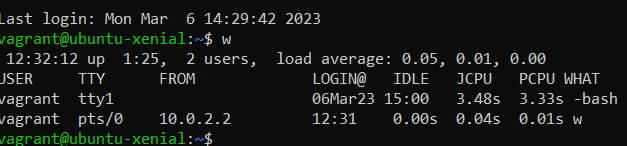

# 10-Toolumgebung 

## GitHub ##

### GitHub Account  ###

Ein GitHub Account kann unter www.github.com erstellt werden. Ein GitHub Account ist eine Voraussetztung für die folgenden Schritte.

## SSH Key ##

### SSH Key erstellen ###

Wir benötigen ein SSH Key, um den Austausch zwischen unserem lokalen GitHub Repository zu ermöglichen. Der lokale SSH Key lässt sich wie folgt einfach im Terminal generieren:
```bash
ssh-keygen -t rsa -b 4096 -C "beispiel@beispiel.com"
```

Daraufhin wird der Key in einer Datei gespeichert.

Danach muss man ein Passwort für den Key festlegen.


### SSH-Key dem SSH-Agent hinzufügen ###
```
Datei %HOME%/.ssh/id_rsa.pub 
```
in die Zwischenablage kopieren.

### SSH Key hinzufügen ###

Man melde sich auf GitHub an.
Jetzt unter Settings -> SSH und GPG Keys auf new key klicken und den genrierten Key einfügen.
Falls das ganze richtig eingerichtet ist, sollte sich das lokale Repository jetzt mit automatischer Authentifiizierung bei GitHub anmelden können.

Man kann sein Repository auch mit der Git-Desktop App synchronisieren.

Diese Schritte musste ich leider zwei mal durchführen, da das ursprüngliche Passwort immer wieder abgefragt wurde. Das hat mich leider ein bisschen Zeit gekostet, aber sonst keine Probleme bereitet.


### Github Client konfigurieren ###

Mit diesen Befehlen leitet man die Authorisierung des GitRepositories auf dem lokalen PC ein.
```bash
  git config --global user.name "<username>"

  git config --global user.email "<e-mail>"
```

### Repository klonen ###
Der untenstehende Befehl dient dazu, unser Repository von der Cloud zu replizieren.
```bash
 clone https://github.com/TimAmbergTBZ/M300-Services
```
Damit das Repository auch am gewünschten Ort ist, müssen wir zuerst in den richtigen Unterordner wechseln.
``` bash
cd M300-Services
```
Um sich das Repository dann herunterzuladen, kann man folgenden Befehl verwenden.
```bash
git pull
```
Um den GitHub Status anzuzeigen, kann man folgenden befehl verwenden.
git status
Repository herunterladen & aktualisieren
Zunächst wollen wir ein Ordner im gewünschten Verzeichnis wählen.
```bash 
cd Users/%currentUser%/Dokumente
```
- Dies ist ein Beispielpfad -

Wenn man im richtigen Pfad ist, kann man diesen Befehhl ausführen:
```bash
mkdir MeinLokalesRepository (z.b M300_Services)
```
Jetzt besteht die Möglichkeit, das ganze Repository auf die Maschine zu klonen.
```bash
git clone git@github.com: <TimAmbergTBZ/M300-Services.git
```
Jetzt ist es sicherlich sinnvoll, den Status zu überprüfen. Das kann man mit:
```bash
git status
```
Mit diesem Befehl lassen sich lokale Änderungen am Repository hochladen
```bash
git pull
```

jetzt gilt es ins Verzeichniss meines Repositories zu wechslen, in meinem Fall:
```bash
cd Users/%currentUser%/documents/m300-services
```
Github kann keine Synchronisation starten, wenn nichts verändert wurde. Desshalb müssen wir jetzt eine Testdatei erstellen.
```bash
git add -A .
```
Jetzt muss man noch die operation bestätigen.
```bash
git commit -m "Mein Kommentar"
```
Dies könnte sein: testfile hinzugefügt
Upload wie gehabt pushen.
```bash
git push
```
### Github-Befehle ###
Das sind die wichtigsten GitHub Befehle:

| Befehl       | Beschreibung                                                                  |
|--------------|-------------------------------------------------------------------------------|
| git init     | Initialisiert ein leeres Git-Repository im aktuellen Ordner                   |
| git add      | Fügt geänderte Dateien in der Arbeitskopie dem Staging-Bereich hinzu         |
| git commit   | Sichert Änderungen im Repository und erstellt einen neuen Commit              |
| git clone    | Kopiert ein Remote-Repository lokal auf den Rechner                           |
| git pull     | Aktualisiert das lokale Repository mit Änderungen aus dem Remote-Repository   |
| git push     | Sendet lokale Commits an das Remote-Repository                                |
| git branch   | Zeigt, erstellt oder löscht Branches im Repository                            |
| git merge    | Kombiniert zwei oder mehr Branches in einem einzigen Branch                   |
| git status   | Gibt den aktuellen Zustand der Arbeitskopie und des Repositories aus          |
| git log      | Listet die Commit-Historie des Repositories auf                               |

## Virtualbox ##
Um mit unserem Projekt weiterzufahren, benötigen wir das Virtualisierungsprogramm VirtualBox.

VirtualBox kann man unter folgendem Link [Herunterladen](https://www.virtualbox.org/wiki/Downloads).


### Was ist VirtualBox ###

VirtualBox ist eine Virtualisierungssoftware, die 2008 entwickelt wurde und heutzutage vom amerikanischen Unternehmen Oracle betrieben wird.
Mit Virtualbox können virtuelle Maschinen mit diversen Betriebssystemen erstellt werden. Virtualbox unterstützt 32- und 64-Bit Betriebsysteme.

### Ubuntu VM erstellen ###

Im nächsten Schritt mussten wir eine Ubuntu VM erstellen. Hierzu gibt es nicht viel zu sagen, das habe ich schon oft gemacht. Jedoch hat die Ubuntu-Installation bei vielen gezickt, so auch bei mir, ich musse das OS zwei mal installieren, bis es funktioniert. Vermutlich lag es daran, das die Festplatte mit 10 GB einfach zu klein für die Installation war. Dies habe ich nämlich im zweiten Anlauf angepasst.

Daraufhin mussten wir Apache Webserver auf dieser VM installieren, was mit dem Linux Terminal mit nur einem Befehl möglich ist.
Dieser Befehl ist:
```bash
sudo apt-get install apache2
```

## Vagrant ##
### Was ist Vagrant ###
Vagrant ist eine Open-Source Anwendung, welche auf Ruby basiert und von hashiCorp entwickelt wurde. Es ist seit 2010 verfügbar. Mit Vagrant kann man virtuelle Maschienen per Script (und somit automatisiert) erstellen.
Man kann sie auch verwalten, zum Beispiel ausschalten oder suspendieren.

Eine sehr nützliche Funktion von Vagrant ist, dass man Vagrant angeben kann, welche Programme er mit der VM mitinstallieren sollte (zum Beispiel Apache Webserver).


Vagrant lässt sich hier [Herunterladen](https://developer.hashicorp.com/vagrant/downloads).

### Vagrant Installation und Einrichtung ###

Vagrant kann hier heruntergeladen werden.

Zuerst sollte man immer an den Pfad navigieren, an welchem man die VM erstellt haben will.

Eine normale VM kann man mit folgenden Befehlen erstellen:
```bash
vagrant init %Betriebsystem%
```
zum Beispiel: 
```bash
vagrant init ubuntu/xenial64
```
Um die VM zu starten, benutzt man folgenden Command.
vagrant up --provider virtualbox

Um auf die VM zuzugreifen, können wir uns SSH zunutze machen.
```bash
vagrant ssh
``` 
Mann kann alle eingehenden SSH Verbindungen nachschauen:


## Apache WebServer mit Vagrant installieren ##
Um den Apache Webserver bei der Installation standartgemäss mit Vagrant zu installieren, müssen wir einige Änderungen am Vagrant File selbst vornehmen.

Hier das File:
```bash
# -*- mode: ruby -*-
# vi: set ft=ruby :

# All Vagrant configuration is done below. The "2" in Vagrant.configure
# configures the configuration version (we support older styles for
# backwards compatibility). Please don't change it unless you know what
# you're doing.
Vagrant.configure("2") do |config|
  # The most common configuration options are documented and commented below.
  # For a complete reference, please see the online documentation at
  # https://docs.vagrantup.com.

  # Every Vagrant development environment requires a box. You can search for
  # boxes at https://vagrantcloud.com/search.
  config.vm.box = "ubuntu/xenial64"

  # Disable automatic box update checking. If you disable this, then
  # boxes will only be checked for updates when the user runs
  # `vagrant box outdated`. This is not recommended.
  # config.vm.box_check_update = false

  # Create a forwarded port mapping which allows access to a specific port
  # within the machine from a port on the host machine. In the example below,
  # accessing "localhost:8080" will access port 80 on the guest machine.
  # NOTE: This will enable public access to the opened port
  # config.vm.network "forwarded_port", guest: 80, host: 8080

  # Create a forwarded port mapping which allows access to a specific port
  # within the machine from a port on the host machine and only allow access
  # via 127.0.0.1 to disable public access
  # config.vm.network "forwarded_port", guest: 80, host: 8080, host_ip: "127.0.0.1"

  # Create a private network, which allows host-only access to the machine
  # using a specific IP.
  # config.vm.network "private_network", ip: "192.168.33.10"

  # Create a public network, which generally matched to bridged network.
  # Bridged networks make the machine appear as another physical device on
  # your network.
  # config.vm.network "public_network"
  config.vm.network "forwarded_port", guest:80, host:8080, auto_correct: true

  # Share an additional folder to the guest VM. The first argument is
  # the path on the host to the actual folder. The second argument is
  # the path on the guest to mount the folder. And the optional third
  # argument is a set of non-required options.
  # config.vm.synced_folder "../data", "/vagrant_data"

  # Provider-specific configuration so you can fine-tune various
  # backing providers for Vagrant. These expose provider-specific options.
  # Example for VirtualBox:
  #
  # config.vm.provider "virtualbox" do |vb|
  #   # Display the VirtualBox GUI when booting the machine
  #   vb.gui = true
  #
  #   # Customize the amount of memory on the VM:
  #   vb.memory = "1024"
  # end
  #
  # View the documentation for the provider you are using for more
  # information on available options.

  # Enable provisioning with a shell script. Additional provisioners such as
  # Ansible, Chef, Docker, Puppet and Salt are also available. Please see the
  # documentation for more information about their specific syntax and use.
  config.vm.provision "shell", inline: <<-SHELL
    sudo apt-get update
    sudo apt-get install -y apache2	
  SHELL
end
```
Die Anpassungen sehen wie folgt aus:
```bash
config.vm.network "forwarded_port", guest:80, host:8080, auto_correct: true
```
Hier wird der Port 80 der VM auf den Port 8080 des Hostes weitergeleitet. Das wird dazu benötigt, um den Apache Server zu testen.
```bash
config.vm.provision "shell", inline: <<-SHELL
    sudo apt-get update
    sudo apt-get install -y apache2	
```
Hier werden mit Terminal commands angegeben, das apache überhaupt installiert wird.

## Visual Studio Code ###

Wir benötigen ein Programm, um Code zu schreiben und diese Dokumentation in Markup zu verfassen. Hier habe ich mich für Visual Studio Code entschieden, da ich dieses Programm schon länger kenne und die Handhabung sehr angenehm ist. 

Damit wir aber optimal arbeiten können, empfehle ich folgende Erweiterungen:


Ich kann alle diese Erweiterungen empfehlen, insbesondere die MarkDown Extesion ist natürlich sehr wichtig für dieses Projekt.
Erweiterungen lassen sich einfach im Programm auf der linken Seite installieren.
## Wo sind Probleme aufgetreten ##

Die von Hand installierte Ubuntu VM musste mehrmals installiert werden, bevor diese richtig korrekt eingerichtet wurde. Dies lag höchstwahrscheindlich an der Festplattengrösse.

Der SSH Key in Gitlab hatte anfangs ein Fehler, sodass ich immer das Passwort eingeben musste, nach einer Neueinrichtung hat das jedoch funktioniert.


