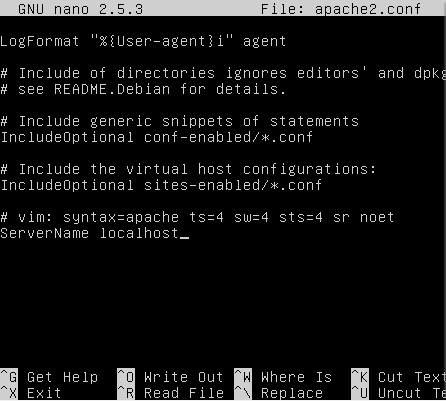

# 25-Sicherheit #

## Firewall ##
Firewalls sind wichtig für die Sicherheit eines Netzwerkes. Sie können Datenverkehr erlauben oder blockieren, je nach dem wie sie konfiguriert sind. Dies wird meistens mit sogennanten Regeln gemacht, jedoch ist das nicht die einzige Variante um die Netzwerksicherheit zu erhöhen.

Eine Firewall muss nicht zwingend ein phyisches Gerät sein, also können wir auch eine VM als Firewall nutzen. Wir benutzen dafür ein programm Namens UFW (Uncomplicated FireWall).
### Firewall Installation ###
Die Firewall kann ganz einfach wiefolgt installiert werden:
```bash
sudo apt-get install ufw
```
Danach muss man diese Firewall nur noch aktivieren, und dann kann sie schon Traffic filtern.

Der Status der Firewall kann mit folgendem Command überprüft werden:
```bash        
sudo ufw status
```
Die Firewall kann man mit diesem Command aktivieren: 
```bash
sudo ufw enable
```
Die folgenden 3 Codeblöcke müssen wir eingeben, um die nötigen Regeln zu ertsellen.
So können die Firewall Regeln eingeben:
```bash
    Port 80 (HTTP) öffnen für alle
    vagrant ssh web
    sudo ufw allow 80/tcp
    exit

    # Port 22 (SSH) nur für den Host (wo die VM laufen) öffnen
    vagrant ssh web
    w
    sudo ufw allow from [Meine-IP] to any port 22
    exit

    # Port 3306 (MySQL) nur für den web Server öffnen
    vagrant ssh database
    sudo ufw allow from [IP der Web-VM] to any port 3306
    exit
```

Legende: Hier sieht man die Commands, um die Rules zu erstellen.
```bash
sudo ufw allow from (IP Adress) to any port (port number)
```


Mit dem Curl command können wir den Inhalt unseres Apache Servers auslesen, dass sieht dann ungefähr so aus:
```bash
$ curl -f 192.168.55.101
```
```bash
$ curl -f 192.168.55.100:3306!
```


Hier sehen wir, wie der Command ein HTML File anzeigt. Das ist gut so, da das heisst, das unser Test erfolgreich war.
Mit diesem Command kann man alle Regeln anschauen:

Hier bin auf ein Problem gestossen: Ich konnte nur mit SSH auf die VM zugreifen, wenn man von allen Geräten eine Verbindung per SSH erlaubt.

Falls eine Regel nicht mehr benötigt wird, kann diese natürlich auch wieder gelöscht werden. Das macht man mit folgendem Command:
```bash
sudo ufw delete X
```


Zum Beispiel:


Status der Firewall kann man mit folgenden Commands überprüfen:
```bash 
    sudo ufw status
    sudo ufw enable
    sudo ufw disable
```
Die Frage stellt sich natürlich nun, wie wir dies automatisieren können. Das ist glücklicherweise relativ simpel, da diese Terminal-Befehle einfach ins Vagrant File reingeschrieben werden können.


Hier ist das Vagrant File, welches ich gebraucht habe, um diese VM zu erstellen:

```bash
Vagrant.configure("2") do |config|

  config.vm.box = "ubuntu/xenial64"


  config.vm.network "forwarded_port", guest:80, host:8080, auto_correct: true


  config.vm.provision "shell", inline: <<-SHELL
    sudo apt-get update
    sudo apt-get install -y apache2
	sudo apt-get install ufw
	sudo ufw allow 80/tcp
	sudo ufw allow from 10.62.109.23 to any port 22
	sudo ufw allow from 10.0.2.15to any port 3306	
  SHELL
end
```

## Reverse Proxy ##

In dieser Aufagbe werden wir den Apache Server als reverse Proxy verwenden.

1. Zuerst müssen wir folgende Module installieren:
```bash
    $ sudo apt-get install libapache2-mod-proxy-html
    $ sudo apt-get install libxml2-dev
```
2. Danach müssen diese Pakete noch installiert werden
```bash
     $ sudo a2enmod proxy
    $ sudo a2enmod proxy_html
    $ sudo a2enmod proxy_http 
```
3. Schritt 1. und 2. können jedoch elegant übersprungen werden, indem wir diese Terminal commands ins vagrant file imtegrieren:
```ruby

Vagrant.configure("2") do |config|

  config.vm.box = "ubuntu/xenial64"

 
  config.vm.network "forwarded_port", guest:80, host:8080, auto_correct: true


  config.vm.provision "shell", inline: <<-SHELL
    sudo apt-get update
    sudo apt-get install -y apache2
	sudo apt-get install ufw
	sudo ufw allow 80/tcp
	sudo ufw allow from 10.62.109.23 to any port 22
	sudo ufw allow from 10.0.2.15to any port 3306
	sudo apt-get install libapache2-mod-proxy-html
	sudo apt-get install libxml2-dev
	sudo a2enmod proxy
	sudo a2enmod proxy_html
	sudo a2enmod proxy_http 
	
  SHELL
end
```
Kommentare wurden der Übersicht halber entfernt.

4. Es gilt folgende Datei zu bearbeiten:
```bash
/etc/apache2/apache2.conf
```
In dieser Datei müssen wir an einer freien Stelle folgendes eintragen:
```
ServerName localhost
 ```


Hier gabe es folgendes Problem: Das Apache Verzeichniss war nicht vorhanden, obwohl apache bereits installiert war.
Ich habe mehrere Male apache neuinstalliert, jedoch ohne Erfolg.
Lösung: Das Problem war ein Syntaxfehler meinerseits. Ich habe im etc Verzeichniss /apache2 angegeben, wenn einfach nur apache2 korrekt gewesen wäre.

Hier sehen wir das angepasste Apache Configfile:


Im nächsten Schritt müssen wir den Apache-Service neustarten:
```bash
sudo service apache2 restart
```
Wenn wir nun in sites-enabled/001-reverseproxy.conf die Pfade einfügen, die wir für den reverse Proxy wollen, können wir mit den richtigen Einstellungen im Vagrant File erfolgreich die Verbindung herstellen.

So ein Vagrant file könnte wiefolgt aussehen:
```ruby
config.vm.define :web do |web|
      web.vm.box = "ubuntu/xenial64"
      web.vm.network :private_network, ip: "10.0.0.20"
      web.vm.hostname = "web"
      web.vm.network "forwarded_port", guest:80, host:8090, auto_correct: true
      web.vm.synced_folder "html/", "/var/www/html"
      web.vm.provision "shell", inline: <<-SHELL
      sudo apt-get update
      sudo apt-get -y install apache2 
      SHELL
  end
Reverse-Proxy
```
Da wir für diese Testumgebung natürlich mehrere VMs brauchen, brauchen wir auch mehrere Vagrant Files, das nachfolgende wäre das zweite Pendant:
```ruby
Vagrant.configure("2") do |config|
  config.vm.define :firewall do |firewall|
      firewall.vm.box = "ubuntu/xenial64"
      firewall.vm.network :private_network, ip: "10.0.0.10"
      firewall.vm.hostname = "Firewall"
      firewall.vm.provision "shell", inline: <<-SHELL
      apt-get update
      sudo apt-get install ufw
      sudo ufw allow 80/tcp
      sudo ufw allow from 10.0.2.2 to any port 22
      sudo ufw allow from 10.0.0.20 to any port 3306
      sudo ufw --force enable
      SHELL
  end
```
Wenn wir jetzt jedoch diese zwei Files zusammenfügen wollen, können wir das mit Docker ebenfalls machen, was jedoch zu einem sehr langen Vagrant file führt.
```ruby
Vagrant.configure("2") do |config|
    config.vm.define :reverseproxy do |reverseproxy|
        reverseproxy.vm.box = "ubuntu/xenial64"
        reverseproxy.vm.network :private_network, ip: "10.0.0.10"
        reverseproxy.vm.network "forwarded_port", guest:80, host:8080, auto_correct: true
        reverseproxy.vm.synced_folder "configs/", "/etc/apache2/sites-enabled/"
        reverseproxy.vm.hostname = "reverseproxy"

        reverseproxy.vm.provision "shell", inline: <<-SHELL
        apt-get update
        sudo apt-get install apache2 -y
        sudo apt-get install ufw -y
        sudo apt-get install libapache2-mod-proxy-html -y
        sudo apt-get install libxml2-dev -y
        sudo a2enmod proxy
        sudo a2enmod proxy_html
        sudo a2enmod proxy_http
        sudo ufw allow from 10.0.2.2 to any port 22
        sudo ufw allow 80/tcp
        sudo ufw --force enable
        SHELL
        reverseproxy.vm.provision "shell", path: "scripts/init.sh"
        reverseproxy.vm.provision "shell", inline: <<-SHELL
        sudo service apache2 restart
        SHELL
    end
    config.vm.define :web do |web|
        web.vm.box = "ubuntu/xenial64"
        web.vm.network :private_network, ip: "10.0.0.20"
        web.vm.hostname = "web"
        web.vm.synced_folder "html/", "/var/www/html"
        web.vm.provision "shell", inline: <<-SHELL
        sudo apt-get update
        sudo apt-get -y install apache2 ufw -y
        sudo ufw allow from 10.0.2.2 to any port 22
        sudo ufw allow from 10.0.0.10 to any port 80
        sudo ufw --force enable
        SHELL
    end
end
```

Mehrere VMs in einem VagrantFile
In diesem VagrantFile werden die Firewall und der Proxy konfiguriert, dieses File zum laufen zu bringen war ziemlich anspruchsvoll:
```ruby
Vagrant.configure("2") do |config|
    config.vm.define :reverseproxy do |reverseproxy|
        reverseproxy.vm.box = "ubuntu/xenial64"
        reverseproxy.vm.network :private_network, ip: "10.0.0.10"
        reverseproxy.vm.network "forwarded_port", guest:80, host:8080, auto_correct: true
        reverseproxy.vm.synced_folder "configs/", "/etc/apache2/sites-enabled/"
        reverseproxy.vm.hostname = "reverseproxy"
        #Oberhalb definieren wir die wichtigsten Eckdaten der VM, wie hostname, IP, die Synchronisierten Order und das OS.
#Dies ist das erste Script. Es kann in Kombination mit den zweiten Script ausgeführt werden, oder einzeln als Vagrant file. 
        reverseproxy.vm.provision "shell", inline: <<-SHELL
        apt-get update
        sudo apt-get install apache2 -y
        sudo apt-get install ufw -y
        sudo apt-get install libapache2-mod-proxy-html -y
        sudo apt-get install libxml2-dev -y
        sudo a2enmod proxy
        sudo a2enmod proxy_html
        sudo a2enmod proxy_http
        #Obehalb von hier konfigurieren wir den Webserver
        sudo ufw allow from 10.0.2.2 to any port 22
        sudo ufw allow 80/tcp
        sudo ufw --force enable
      #Oberhalb von hier definieren wirt die Firewallregeln
        SHELL
        reverseproxy.vm.provision "shell", path: "scripts/init.sh"
        reverseproxy.vm.provision "shell", inline: <<-SHELL
        sudo service apache2 restart
        SHELL
    end
```
```ruby
    config.vm.define :web do |web|
    #hier ist das Script für die zweite VM, mann kann aber beide im selben File konfigurieren
        web.vm.box = "ubuntu/xenial64"
        web.vm.network :private_network, ip: "10.0.0.20"
        web.vm.hostname = "web"
    #oberhalb von hier definieren wir die wichtigsten Paramter für die zweite VM
        web.vm.synced_folder "html/", "/var/www/html"
        web.vm.provision "shell", inline: <<-SHELL
    #hier definieren wir wir die synced folders
        sudo apt-get update
        sudo apt-get -y install apache2 ufw -y
    #hier wird der apacheServer installiert
        sudo ufw allow from 10.0.2.2 to any port 22
        sudo ufw allow from 10.0.0.10 to any port 80
        sudo ufw --force enable
        #oberhalb wird die Firewall konfiguriert
        SHELL
    end
    
end
```

## Refelektion ##
### Positiv ###
Alles in allem haben die Aufträge gut geklappt, ich habe mich manchaml festgefahren oder bin stecken geblieben, jedoch mit Recherche aus dem Internet und teilweiser Hilfe von Klassenkameraden konnte ich soweit jedes Problem lösen.
Ich habe ab und zu mit den anderen zusammengearbeitet, das hat äussert gut funktioniert, wir haben gemeinsam immer schnell eine Lösung gefunden. Ich hoffe, wir können in Zukunft weiter so gut zusammenarbeiten, dann bin ich zuversichtlich, dass wir auch kommende Hürden überwinden können.
### Negativ ###
Oft war mir jedoch beim Durchlesen des Auftrages nicht klar, was konkret zu tun ist. ich habe jeweils die genauen Aufträge durch meine Klassenkameraden erfahren, was jedoch umständiger ist als nötig. Wenn ich ein Verbesserungsvorschlag anbringen darf, dann wäre es dass.

Einige Themen konnte ich leider nicht meistern. Das wäre LDAP und die SSH-Connection. Wir haben da lange herumprobiert, sind leider jedoch auf keinen grünen Zweig gekommen. Das fand ich schade, hier wäre vielleicht eine genauere Beschreibung oder eine Art Hilfe-Manual sehr nützlich gewesen.