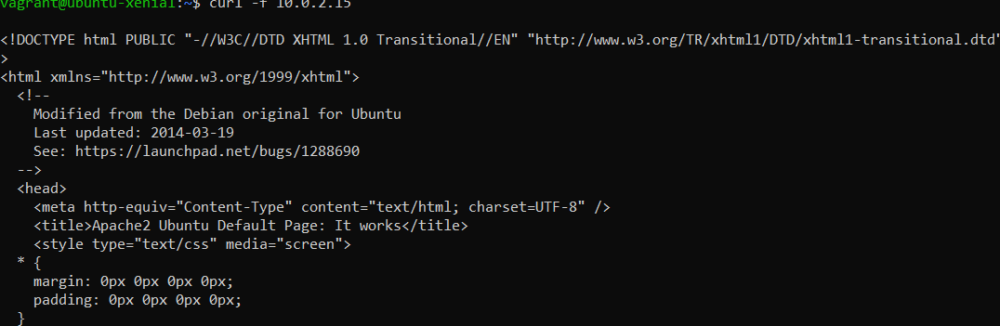
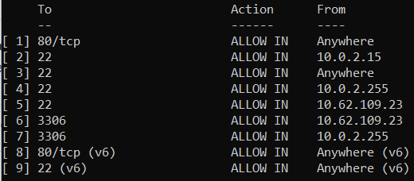
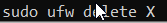
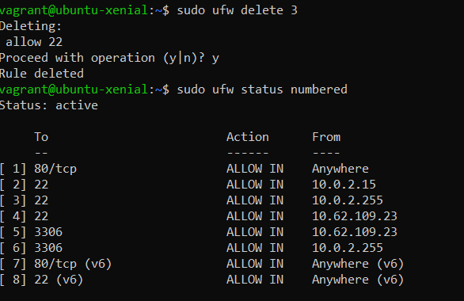
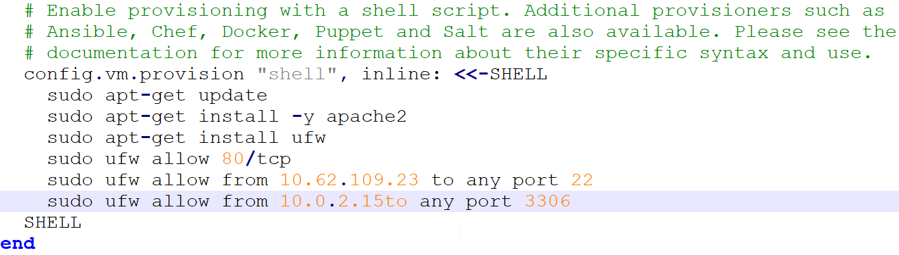

# Sicherheit #

## Firewall ##
Eine Firewall kann in einer VM erstellt werden. Wir benutzen dafür UFW (Uncomplicated FireWall).

Die Firewall kann ganz einfach wiefolgt installiert werden:

    sudo ufw status

Danach muss man diese Firewall nur noch aktivieren, und dann kann sie schon Traffic filtern.

Der Status der Firewall kann mit folgendem Command überprüft werden:
        
        sudo ufw status

Die Firewall kann man mit diesem Command aktivieren: 

     sudo ufw enable
            

So können die Firewall Regeln eingeben:
    Port 80 (HTTP) öffnen für alle
    vagrant ssh web
    sudo ufw allow 80/tcp
    exit

    # Port 22 (SSH) nur für den Host (wo die VM laufen) öffnen
    vagrant ssh web
    w
    sudo ufw allow from [Meine-IP] to any port 22
    exit

    # Port 3306 (MySQL) nur für den web Server öffnen
    vagrant ssh database
    sudo ufw allow from [IP der Web-VM] to any port 3306
    exit

Legende: Hier sieht man die Commands, um die Rules zu erstellen.

Mit dem Curl command können wir den Inhalt unseres Apache Servers auslesen, dass sieht dann ungefähr so aus:
    $ curl -f 192.168.55.101
    $ curl -f 192.168.55.100:3306!

    
   

Mit diesem Command kann man alle Regeln anschauen:

Hier bin auf ein Problem gestossen: Ich konnte nur mit SSH auf die VM zugreifen, wenn man von allen Geräten eine Verbindung per SSH erlaubt.

Falls eine Regel nicht mehr benötigt wird, kann diese natürlich auch wieder gelöscht werden. Das macht man mit folgendem Command:

Zum Beispiel:

Status der Firewall kann man mit folgenden Commands überprüfen:

    sudo ufw status
    sudo ufw enable
    sudo ufw disable

Die Frage stellt sich natürlich nun, wie wir dies automatisieren können. Das ist glücklicherweise relativ simpel, da diese Terminal-Befehle einfach ins Vagrant File reingeschrieben werden können.

