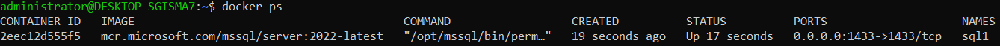

# Container #

Wichtigste Merkmale von Containern:

 - Container teilen sich Ressourcen mit dem Host-Betriebssystem
 - Container können im Bruchteil einer Sekunde gestartet und gestoppt werden
Anwendungen, die in Containern laufen, verursachen wenig bis gar keinen Overhead
- Container sind portierbar --> Fertig mit "Aber bei mir auf dem Rechner lief es doch!"
 - Container sind leichtgewichtig, d.h. es können dutzende parallel betrieben werden.
 - Container sind "Cloud-ready"!
  ### MicroServices ###
  Einer der grössten Anwendungsfälle und die stärkste treibende Kraft hinter dem Aufstieg von Containern sind Microservices.
Microservices sind ein Weg, Softwaresysteme so zu entwickeln und zu kombinieren, dass sie aus kleinen, unabhängigen Komponenten bestehen, die untereinander über das Netz interagieren. Das steht im Gegensatz zum klassischen, monolithischen Weg der Softwareentwicklung, bei dem es ein einzelnes, grosses Programm gibt.
Wenn solch ein Monolith dann skaliert werden muss, kann man sich meist nur dazu entscheiden, vertikal zu skalieren (scale up), zusätzliche Anforderungen werden in Form von mehr RAM und mehr Rechenleistung bereitgestellt. Microservices sind dagegen so entworfen, dass sie horizontal skaliert werden können (scale out), indem zusätzliche Anforderungen durch mehrere Rechner verarbeitet werden, auf die die Last verteilt werden kann.
In einer Microservices-Architektur ist es möglich, nur die Ressourcen zu skalieren, die für einen bestimmten Service benötigt werden, und sich damit auf die Flaschenhälse des Systems zu beschränken. In einem Monolith wird alles oder gar nichts skaliert, was zu verschwendeten Ressourcen führt.
## Docker ##
Docker nahm die bestehende Linux-Containertechnologie auf und verpackte und erweiterte sie in vielerlei Hinsicht – vor allem durch portable Images und eine benutzerfreundliche Schnittstelle –, um eine vollständige Lösung für das Erstellen und Verteilen von Containern zu schaffen.
Die Docker-Plattform besteht vereinfacht gesagt aus zwei getrennten Komponenten: der Docker Engine, die für das Erstellen und Ausführen von Containern verantwortlich ist, sowie dem Docker Hub, einem Cloud Service, um Container-Images zu verteilen.
Wichtig: Docker wurde für 64-bit Linux Systeme entwickelt, kann jedoch auch mittels VirtualBox auf Mac und Windows betrieben werden.
## Docker Architektur ##
Nachfolgend sind die wichtigsten Komponenten von Docker aufgelistet:
### Docker Deamon ### 

Erstellen, Ausführen und Überwachen der Container
Bauen und Speichern von Images

Der Docker Daemon wird normalerweise durch das Host-Betriebssystem gestartet.
### Docker Client ### 

Docker wird über die Kommandozeile (CLI) mittels des Docker Clients bedient
Kommuniziert per HTTP REST mit dem Docker Daemon

Da die gesamte Kommunikation über HTTP abläuft, ist es einfach, sich mit entfernten Docker Daemons zu verbinden und Bindings an Programmiersprachen zu entwickeln.
Images 

Images sind gebuildete Umgebungen welche als Container gestartet werden können
Images sind nicht veränderbar, sondern können nur neu gebuildet werden.
Images bestehen aus Namen und Version (TAG), z.B. ubuntu:16.04.

Wird keine Version angegeben wird automatisch :latest angefügt.


### Container ### 

Container sind die ausgeführten Images
Ein Image kann beliebig oft als Container ausgeführt werden
Container bzw. deren Inhalte können verändert werden, dazu werden sogenannte Union File Systems verwendet, welche nur die Änderungen zum original Image speichern.

### Docker Registry ### 

In Docker Registries werden Images abgelegt und verteilt

Die Standard-Registry ist der Docker Hub, auf dem tausende öffentlich verfügbarer Images zur Verfügung stehen, aber auch "offizielle" Images.
Viele Organisationen und Firmen nutzen eigene Registries, um kommerzielle oder "private" Images zu hosten, aber auch um den Overhead zu vermeiden, der mit dem Herunterladen von Images über das Internet einhergeht.
## Docker Commands ##

- **Image Commands**
  - `docker build`: Build an image from a Dockerfile
  - `docker pull`: Pull an image from a registry
  - `docker push`: Push an image to a registry
  - `docker images`: List images on your system
  - `docker rmi`: Remove one or more images from your system

- **Container Commands**
  - `docker run`: Create a new container and start it
  - `docker start`: Start a stopped container
  - `docker stop`: Stop a running container
  - `docker rm`: Remove one or more containers from your system
  - `docker ps`: List running containers
  - `docker logs`: View the logs of a container
  - `docker exec`: Run a command in a running container

- **Networking Commands**
  - `docker network create`: Create a new network
  - `docker network ls`: List all networks
  - `docker network connect`: Connect a container to a network
  - `docker network disconnect`: Disconnect a container from a network

- **Volume Commands**
  - `docker volume create`: Create a new volume
  - `docker volume ls`: List all volumes
  - `docker volume rm`: Remove one or more volumes from your system
  - `docker run -v`: Mount a volume to a container

- **Other Commands**
  - `docker login`: Log in to a registry
  - `docker logout`: Log out of a registry
  - `docker info`: Display system-wide information about Docker

## Docker Configuration ##
Stellen Sie sich vor, Sie lassen einen Webserver in einem Container laufen. Wie können Sie dann der Aussenwelt darauf Zugriff gewähren?

Man muss Ports nach aussen mit folgendem Command öffnen:

```
docker -p
``` 
Danach führen wir diesen Command aus, um den Container neuzustarten.
```
docker run --rm -d -P mysql
```

ich habe ein SQL Container Image wiefolgt heruntergeladen:
```bash
sudo docker pull mcr.microsoft.com/mssql/server:2022-latest
```
 Danach habe ich folgenden Command ausgeführt:
 ```bash
 sudo docker run -e "ACCEPT_EULA=Y" -e "MSSQL_SA_PASSWORD=<YourStrong@Passw0rd>" \
   -p 1433:1433 --name sql1 --hostname sql1 \
   -d \
   mcr.microsoft.com/mssql/server:2022-latest
```
Hiermit habe ich das Image gestartet.

Wenn wir jetzt den command:
```bash
sudo docker ps
```
ausführen, dann gilt es zu erwarten, das wir nun unseren gestarteten Container in der Liste sehen würden:


Und wie wir sehen, wird der Container richtig angezeigt.
